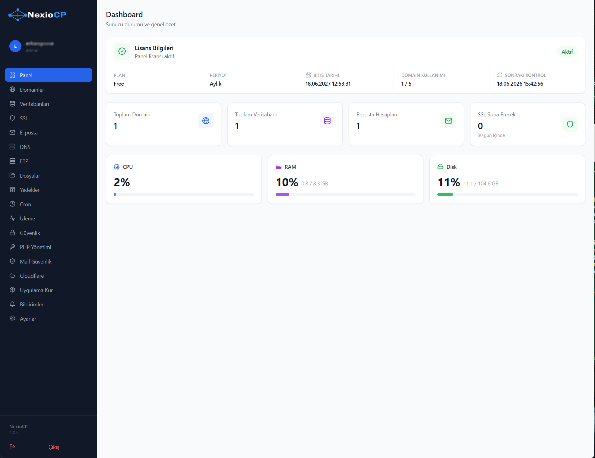
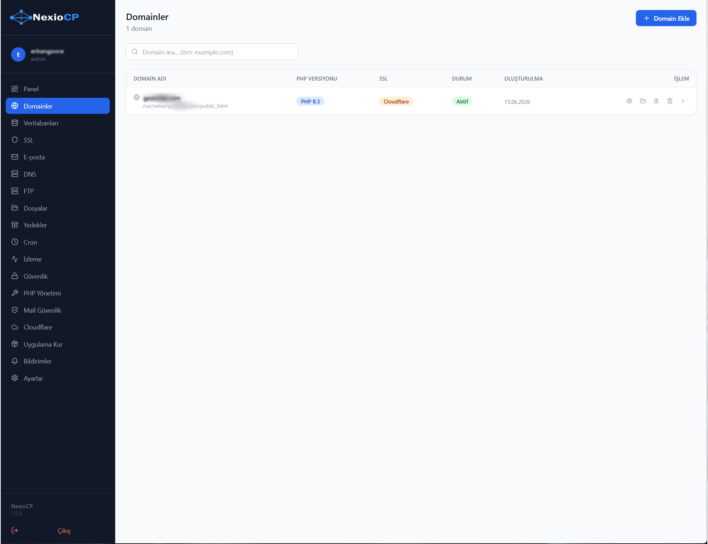
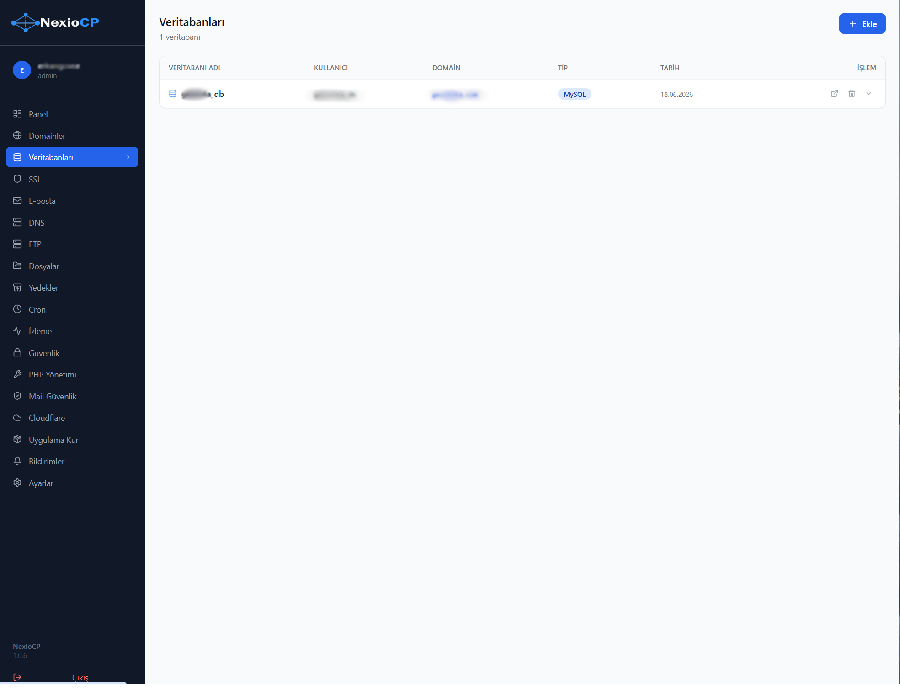
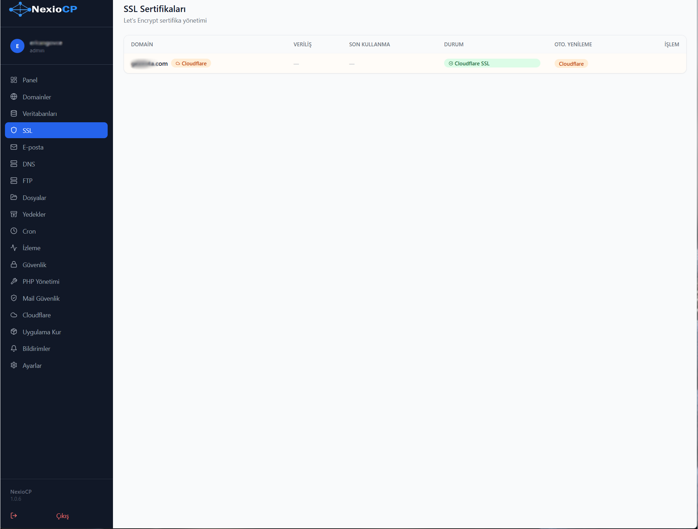
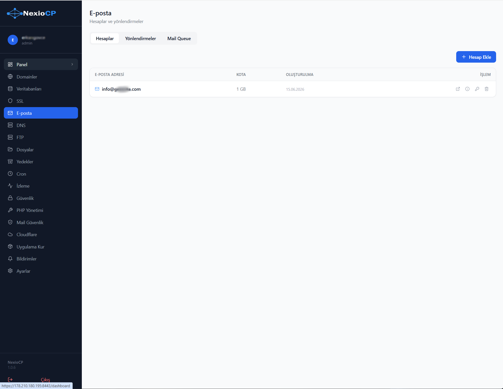
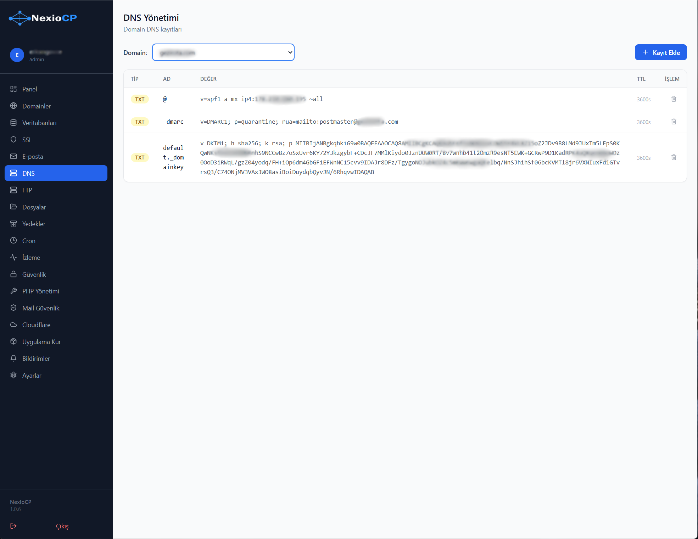
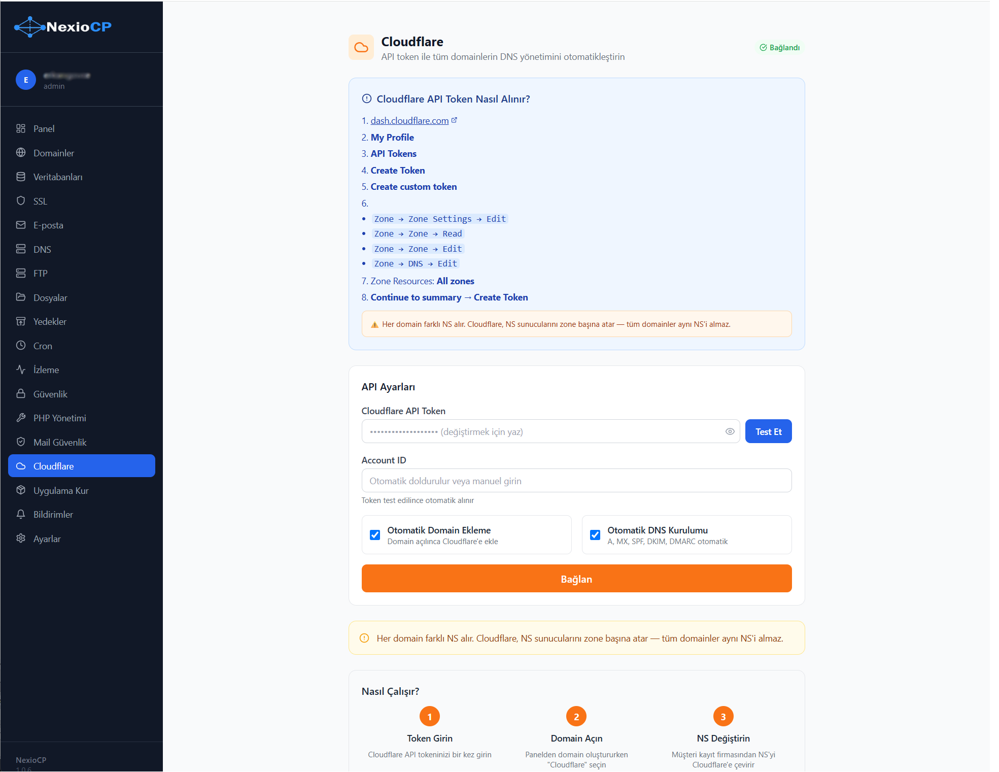
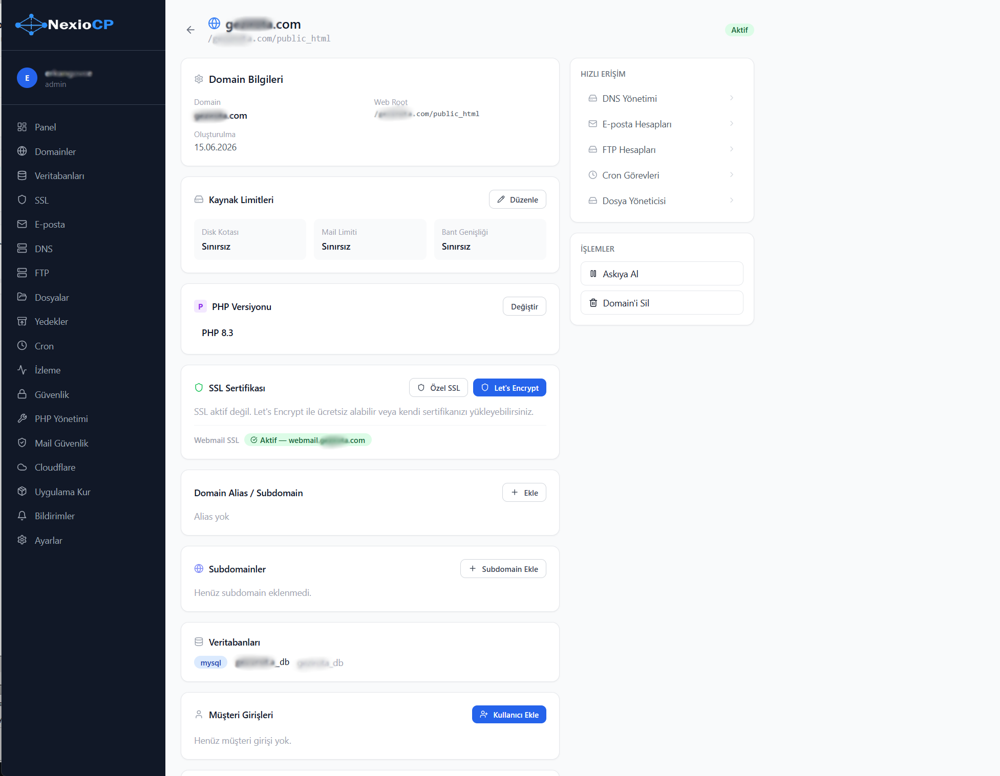

# NexioCP

Modern Linux Hosting Control Panel for Ubuntu servers with Turkish language support.



## Features

- Domain Management
- DNS Management
- Email Management
- FTP Management
- SSL Management
- File Manager
- Backup System
- System Monitoring
- License Management

---

## Screenshots

### Dashboard


















---

## Installation

```bash
wget https://cdn.nexiocp.com/install.sh
chmod +x install.sh
sudo bash install.sh
```

---

## Documentation

- [Installation Guide](docs/NexioCP_Kurulum_ve_Kullanim_Kilavuzu_v1.0.pdf)
- [Roadmap](ROADMAP.md)
- [Changelog](CHANGELOG.md)

---

## Project Status

NexioCP v1.x is currently in active development.

Community feedback and contributions are welcome.
